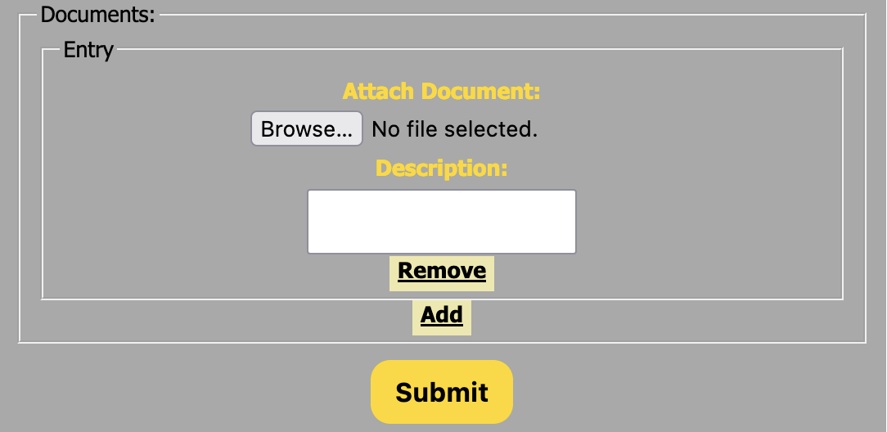
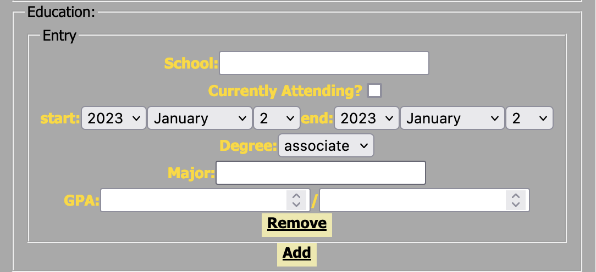
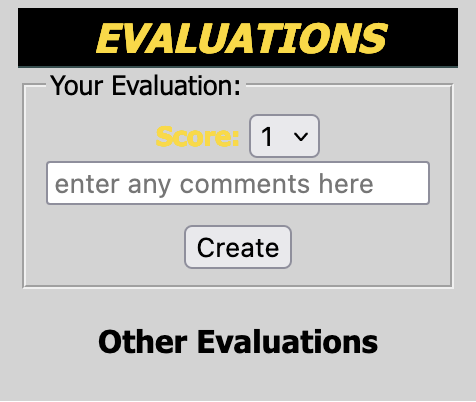
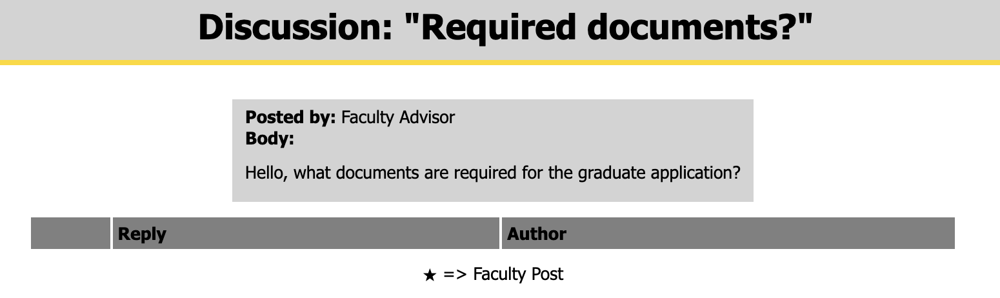

# Welcome to the Grad App Project


- [Welcome to the Grad App Project](#welcome-to-the-grad-app-project)
- [Features](#features)
  - [Graduate Application Submission](#graduate-application-submission)
  - [Discussions](#discussions)
  - [Research Areas](#research-areas)
- [Developer Documenation](#developer-documenation)
  - [Version Information](#version-information)
  - [Setup](#setup)
    - [Local Environment](#local-environment)
      - [Install gem dependencies for dev environment](#install-gem-dependencies-for-dev-environment)
      - [Setup the local DB](#setup-the-local-db)
    - [Run Local Rails Server](#run-local-rails-server)
    - [Deploying to Heroku](#deploying-to-heroku)
  - [Project Organization Tools](#project-organization-tools)
    - [Commit Messages](#commit-messages)
    - [Pull Requests](#pull-requests)
    - [Actions Pipeline](#actions-pipeline)
      - [Our workflow does the following:](#our-workflow-does-the-following)
  - [Miscellaneous](#miscellaneous)
    - [Code Coverage](#code-coverage)

# Features

## Graduate Application Submission
- Attach documents to your application (such as transcripts and references) which are securely stored in the Google Cloud.
<p align="center">
  
</p>

- Add your education history to the application to give faculty more information on your background in academia.
<p align="center">
  
</p>

- Applications that have been submitted are then reviewed by faculty through the evaluations section.
<p align="center">
  
</p>

## Discussions
- Students and faculty can submit and reply to discussion threads to ask/answer questions and learn more about the programs offered.
<p align="center">
  
</p>

- Direct messages can be sent between users of the platform.

## Research Areas
Faculty may add details about the research area they represent to inform prospective students.

# Developer Documenation

## Version Information
Below are details regarding the tech stack of the project and versions utilized by the team.

- *Ruby:* 2.6.6p146
- *Rails:* 4.2.10
- *Bundler:* 1.17.3

## Setup

### Local Environment

#### Install gem dependencies for dev environment
```bash
bundle install --without production
```

#### Setup the local DB
```bash
bundle exec rake db:migrate
bundle exec rake db:seed
```

### Run Local Rails Server
```bash
bundle exec rails server
```

You should now be able to navigate the SaaS app on your browser at http://localhost:3000/

### Deploying to Heroku
Currently, our deployments are managed by a continuous integration, continuous deployment pipeline powered by GitHub Actions. See the [Actions Pipeline](#actions-pipeline) section for more information. We do include steps for manual deployment, if you so prefer.

1. Run `heroku create -a [NAME]` on your local repository
    - If you already have a live heroku app, you can just add that remote heroku repository with `heroku git:remote -a [APP_NAME]`
2. When you are ready to push your local git repository to heroku, run `git push heroku main` (or whatever you have named your remote heroku branch)
    - **NOTE:** You may get a message during the build/deployment of your app on Heroku mentioning an unsupported stack. This is because we use an older version of rails (2.6.6) which requires heroku stack 20 or earlier. You can change your heroku stack with `heroku stack:set heroku-20` then try pushing changes again.
3. Run `heroku run bundle exec rake db:migrate` to migrate DB to the latest version. (You can also seed if needed, but only do this once)

Your site should now be live on Heroku!

## Project Organization Tools

### Commit Messages

We follow closesly with the [Conventional Commits Standard](https://www.conventionalcommits.org/en/v1.0.0/#specification). Below is a breif summary of this convention:

**Format:**

```
<type>[optional scope]: <description>

[optional body]

[optional footer(s)]
```

- Main Types: *fix* or *feat*
  - *fix:* A patch to a bug in your codebase. Use this if your changes resolve an existing bug
  - *feat:* A new feature introduced. Use this if your change creates a new piece of functionality that did not previously exist
  - **other types used:**
    - *db:* for database related changes (typically a new migration etc.)
    - *test:* rspec/feature related tests being added or modified
    - *doc:* documentation related changes (such as READMEs)
- Keep descriptions breif (<72 characters), you should be able to glance at a commit message and recognize what it is doing.
- Utilize the body for technical discussion - think about what someone investigating your commit would appreciate knowing.


### Pull Requests

An open pull request can only be merged to the main branch once the following have occured:
1. Two other members of the team reviewed and approved the pull request
2. There are no merge conflicts with main
3. All relevant stages of the [Actions Pipeline](#actions-pipeline) are passing

### Actions Pipeline
To speed up development and maintain a consistent level of quality for our product, we implement a continuous integration, continuous deployment (CI/CD) pipeline, powered by GitHub Actions. Our workflow automatically performs a suite of tests to ensure changes merged to our main branch do not break existing features. We also perform multiple staged deployments to enable quality assurance leading up to a stable release. Any feature that is merged to the main branch will be automatically deployed to our [beta website](https://uiowa-grad-app-beta.herokuapp.com/). Tagged releases are deployed to a production channel that is programatically determined based on the current iteration. You can view the release from our most recent iteration [here](https://uiowa-grad-app-v3.herokuapp.com/).

#### Our workflow does the following:
1. Assert that all tests are passing in Cucumber and rSpec, preventing the pull request from being merged if any are not
2. Perform linting to ensure additions meet our standard for coding consistency and best-practice (we use [rubocop](https://rubocop.org))
3. Deploy a localized instance of the application to isolate any potential issues relating to the application itself, rather than its infrastructure
4. Confirm that any new feature or release is located at the top of our main branch, preventing unapproved changes from ending up in beta or production
5. Deploy unstable builds into beta following each addition of a new feature
6. For tagged, end-of-sprint releases only, deploy a stable build into production

## Miscellaneous

### Code Coverage
As of the latest release ([selt2022_sprint3](https://github.com/UIOWAjohnsonhj/selt2022_teamprojects-team-4/tree/selt2022_sprint3)), our line coverage is **92.44%**. You can view the latest line and branch coverage [here](https://github.com/UIOWAjohnsonhj/selt2022_teamprojects-team-4/blob/main/coverage/.last_run.json). 
